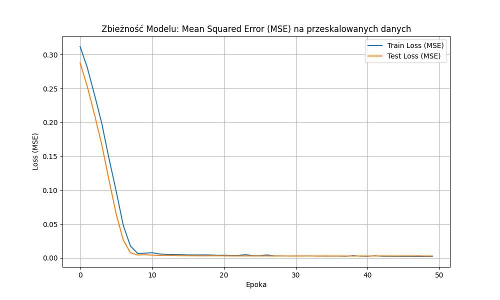
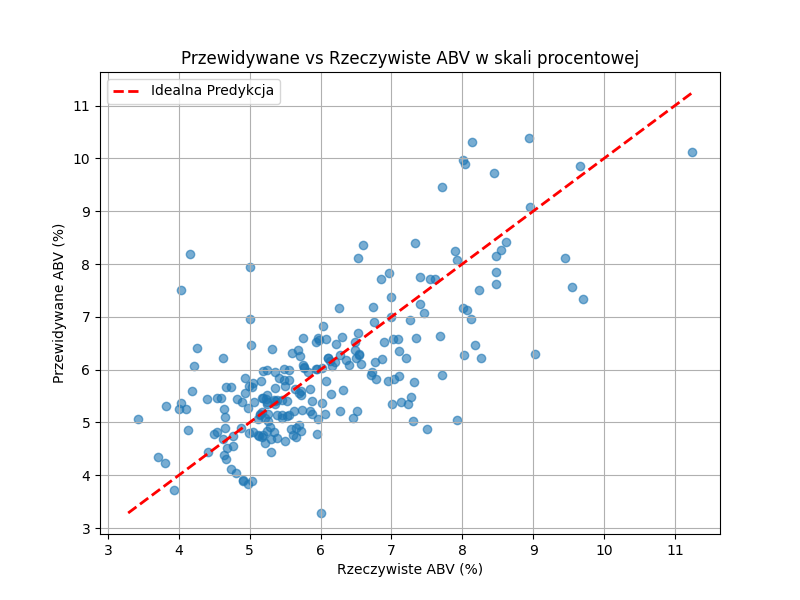

# 🍺 Przewidywanie Zawartości Alkoholu (ABV) w Piwie

Ten skrypt Pythona wykorzystuje bibliotekę **PyTorch** do zbudowania i wytrenowania prostej **sieci neuronowej** typu **MLP (Multi-Layer Perceptron)** do przewidywania procentowej zawartości alkoholu (**ABV**) na podstawie składników i parametrów receptur piwa.

## 🚀 Podstawowe Informacje

* **Cel:** Przewidywanie wartości **ABV** (Alcohol by Volume).
* **Zbiór Danych:** Przepisy na piwo pobrane z Kaggle (`jtrofe/beer-recipes`).
* **Architektura Modelu:** Prosta sieć MLP z dwoma ukrytymi warstwami.
    * Warstwa 1: 32 neurony (aktywacja ReLU)
    * Warstwa 2: 16 neuronów (aktywacja ReLU)
    * Warstwa Wyjściowa: 1 neuron (regresja)
* **Funkcja Straty:** **Mean Squared Error (MSE)** - typowa dla zadań regresji.
* **Optymalizator:** **Adam**.
* **Normalizacja:** Dane wejściowe i wyjściowe (`ABV`) są skalowane do zakresu $[0, 1]$ przez dzielenie przez ich maksymalną wartość bezwzględną.

## 🔧 Uruchomienie

1.  **Pobranie Danych:** Skrypt automatycznie pobiera zbiór danych z Kaggle (wymaga skonfigurowanego klucza Kaggle).
2.  **Przygotowanie Danych:**
    * Usunięcie brakujących wartości.
    * Usunięcie kolumn nieistotnych dla predykcji.
    * Kodowanie zmiennych kategorialnych (np. `BrewMethod`, `SugarScale`) za pomocą **One-Hot Encoding** (`pd.get_dummies`).
    * Normalizacja numerycznych cech i wartości `ABV`.
3.  **Trening:** Sieć trenowana jest przez **50 epok** z użyciem zbioru treningowego.
4.  **Ocena i Wizualizacja:**
    * Generowane są dwa wykresy:
        1.  **Krzywa Utraty (Loss Curve):** Pokazuje zbieżność modelu (spadek MSE) na zbiorach treningowym i testowym w kolejnych epokach.
        2.  **Wykres Rozrzutu Predykcji:** Porównuje przewidywane wartości `ABV` (w oryginalnej skali procentowej) z rzeczywistymi wartościami na zbiorze testowym. Czerwona przerywana linia reprezentuje idealną predykcję.

## 📊 Wyniki (Wizualizacje)

Po zakończeniu treningu wyświetlane są wykresy:

### 1. Zbieżność Modelu: Mean Squared Error (MSE) na przeskalowanych danych

* **Interpretacja:** Wykres pokazuje, jak błąd (Loss) maleje wraz z kolejnymi epokami, co świadczy o uczeniu się modelu. Porównanie strat na zbiorze treningowym i testowym pozwala ocenić, czy nie występuje nadmierne dopasowanie (overfitting).

### 2. Przewidywane vs Rzeczywiste ABV w skali procentowej

* **Interpretacja:** Punkty blisko czerwonej, przerywanej linii oznaczają dobrą precyzję predykcji. Rozrzut wokół tej linii wskazuje na błąd przewidywania.
