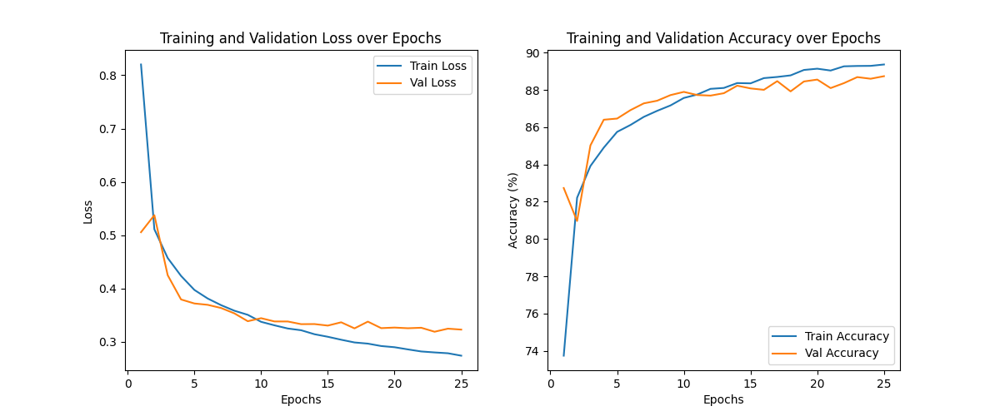
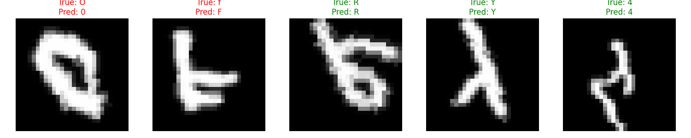

# ✍️ Rozpoznawanie Znaków EMNIST za pomocą Sieci CNN (PyTorch)

Ten projekt wykorzystuje bibliotekę **PyTorch** do zbudowania, wytrenowania i ewaluacji **Konwolucyjnej Sieci Neuronowej (CNN)** do klasyfikacji 47 zbalansowanych klas znaków (cyfry, duże i małe litery) z zestawu danych **EMNIST (Extended MNIST)**.

## ✨ Kluczowe Technologie i Architektura

| Kategoria | Detal | Opis |
| :--- | :--- | :--- |
| **Framework** | **PyTorch & Torchvision** | Służy do budowy modelu i zarządzania danymi (data augmentation, loadery). |
| **Zbiór Danych** | **EMNIST 'Balanced'** | Zawiera **47 klas** znaków (0-9, A-Z, a, b, d, e, f, g, h, n, r, t). |
| **Architektura** | **CNN (Convolutional Neural Network)** | Model zaprojektowany do ekstrakcji cech obrazu. |
| **Struktura CNN** | **Conv-BN-Pool (x3)** $\rightarrow$ **FC-Dropout** $\rightarrow$ **FC** | Trzy bloki konwolucyjne, następnie warstwy w pełni połączone. |
| **Funkcja Straty** | **CrossEntropyLoss** | Standardowa funkcja dla zadań klasyfikacji wieloklasowej. |
| **Optymalizator** | **Adam** | Używany do minimalizacji straty. |

---

## ⚙️ Konfiguracja i Trening

### Hiperparametry

| Parametr | Wartość | Opis |
| :--- | :--- | :--- |
| **Liczba Klas** | 47 | Zgodna ze zbiorem EMNIST 'Balanced'. |
| **Epoki** | 25 | Liczba pełnych przebiegów treningowych. |
| **Batch Size** | 128 | Rozmiar paczki danych przetwarzanej w jednym kroku. |
| **Learning Rate** | $0.001$ | Szybkość uczenia optymalizatora Adam. |

### Przetwarzanie Danych (Data Augmentation)

Aby zwiększyć odporność i generalizację modelu, do obrazów zastosowano następujące transformacje:

* **Tensor Conversion:** Konwersja na tensor.
* **Rotacja i Odbicie:** Odwrócenie osi obrazu (`transpose(1, 2).flip(1)`) w celu dopasowania orientacji obrazów EMNIST.
* **Affiny:** Zastosowanie losowych transformacji afinicznych (obrót o $\pm 15^\circ$, przesunięcie o $0.1$, skalowanie $0.9-1.1$).

## 📊 Wyniki i Wizualizacje

Po zakończeniu treningu generowane są kluczowe wykresy ewaluacyjne oraz wizualizacja predykcji.

### 1. Krzywe Uczenia (Loss i Accuracy)

Generowane są dwa wykresy (Loss i Accuracy) porównujące metryki na zbiorze **Treningowym** i **Walidacyjnym** w trakcie 25 epok.

* **Interpretacja Loss:** Obserwacja spadku straty i braku rozbieżności między krzywymi Loss wskazuje na efektywne uczenie i kontrolę nad overfittingiem.
* **Interpretacja Accuracy:** Wzrost dokładności na obu zbiorach potwierdza zdolność modelu do generalizacji i poprawnego klasyfikowania znaków.

### 2. Wizualizacja Predykcji Modelu

Prezentuje się próbkę poprawnych i niepoprawnych predykcji na zbiorze testowym. 

* **Zielony Tytuł:** Oznacza poprawną predykcję (**True = Pred**).
* **Czerwony Tytuł:** Oznacza błędną predykcję (**True $\neq$ Pred**), ilustrując typowe błędy popełniane przez model.