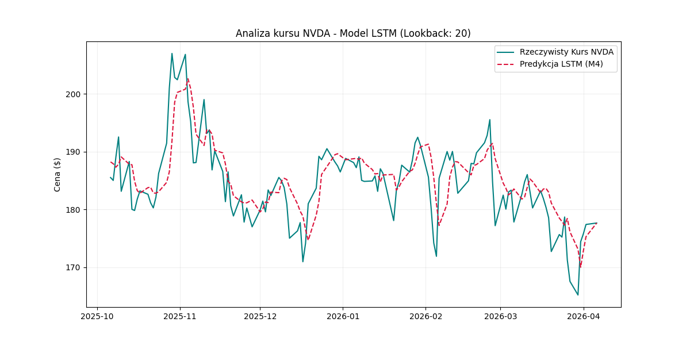

# 📈 Przewidywanie Kursu Akcji NVIDIA (NVDA) za pomocą LSTM

Ten skrypt wykorzystuje bibliotekę **PyTorch** oraz architekturę sieci rekurencyjnych **LSTM (Long Short-Term Memory)** do prognozowania przyszłych cen zamknięcia akcji spółki NVIDIA na podstawie danych historycznych z ostatnich 10 lat.

## 🚀 Podstawowe Informacje

* **Cel:** Regresja szeregów czasowych – przewidywanie ceny `Close` na dzień $t$ na podstawie okna czasowego z ostatnich 20 dni.
* **Źródło Danych:** Notowania giełdowe pobierane w czasie rzeczywistym przez `yfinance`.
* **Architektura Modelu:** Głęboka sieć rekurencyjna LSTM:
    * **Wejście:** Sekwencja 20 dni (cena zamknięcia).
    * **Warstwy LSTM:** 2 warstwy (stacked), 64 jednostki ukryte.
    * **Warstwa Wyjściowa:** 1 neuron (Linear) zwracający przewidywaną cenę.
* **Funkcja Straty:** **Mean Squared Error (MSE)**.
* **Optymalizator:** **Adam** (lr=0.001).
* **Urządzenie:** Automatyczna detekcja **Apple Silicon (M4/M3/MPS)**, **CUDA** lub **CPU**.

## 🔧 Logika Przetwarzania

1.  **Inżynieria Cech (Lagged Features):** Przekształcenie danych w "okna czasowe". Każdy rekord zawiera cenę docelową oraz 20 cen z dni poprzednich.
2.  **Normalizacja:** Skalowanie danych za pomocą `MinMaxScaler` do zakresu $[0, 1]$. Jest to kluczowe dla stabilności sieci LSTM.
3.  **Reshaping:** Dane wejściowe są formatowane do tensora 3D: `[Batch, Time_Steps, Features]`, co pozwala modelowi analizować chronologiczną sekwencję zdarzeń.
4.  **Podział Chronologiczny:** Ostatnie 5% danych historycznych zostaje odcięte jako zbiór testowy, aby sprawdzić skuteczność modelu na danych, których nie widział podczas treningu.

## 📊 Wyniki i Wizualizacja

Po zakończeniu 50 epok treningu, skrypt generuje wykres porównawczy:

### Przewidywane vs Rzeczywiste Kursy NVDA

* **Niebieska linia:** Prawdziwa cena akcji z historycznego zbioru testowego.
* **Czerwona przerywana linia:** Predykcja modelu na podstawie danych wejściowych.
* **Oś X:** Poprawnie sformatowane daty giełdowe.

