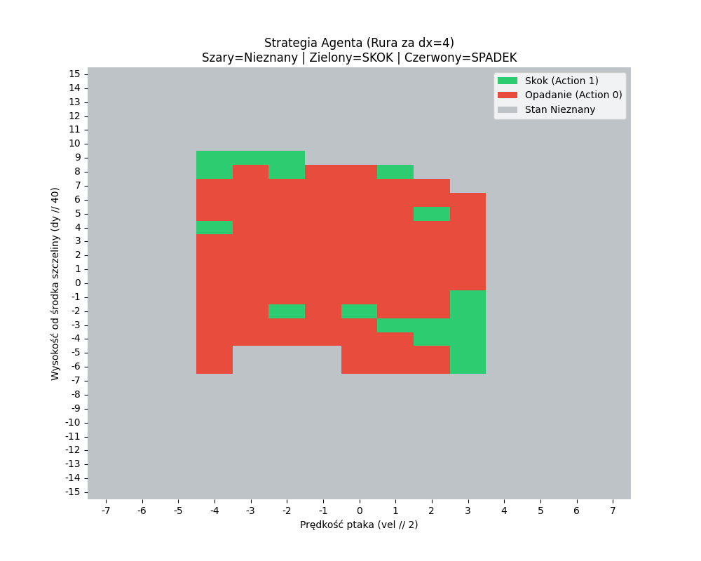

# 🐦 Flappy Bird AI: From RL to CNN

Projekt implementacji inteligentnego agenta grającego w klona Flappy Bird. Rozwój projektu zakłada przejście od klasycznego uczenia ze wzmocnieniem (Reinforcement Learning) po zaawansowane sieci splotowe (CNN).

## 🚀 O Projekcie
Celem projektu jest stworzenie AI, które nauczy się nawigować ptakiem pomiędzy rurami, optymalizując swój wynik na podstawie systemu nagród. Projekt bazuje na silniku **Pygame** i nowoczesnych standardach programowania w Pythonie.

## 📈 Etapy Rozwoju

### Faza 1: Klasyczne Reinforcement Learning (RL) 
Agent podejmuje decyzje na podstawie wektora cech (state vector) wyciągniętego bezpośrednio z silnika gry.

#### 🧠 Jak działa Q-Learning w tym projekcie?
Używamy algorytmu **Tabular Q-Learning**. Agent buduje tablicę (słownik), w której przechowuje tzw. wartości Q dla każdej pary **stan-akcja**. 


* **Stan (State):** Pionowa prędkość ptaka, dystans poziomy do luki oraz różnica wysokości między ptakiem a luką.
* **Akcja (Action):** Skok (Flap) lub Opadanie (Idle).
* **Nagroda (Reward):** Agent otrzymuje punktową karę za kolizję i nagrodę za każdą ramkę przetrwania oraz pokonanie rury.

#### ⚠️ Minusy i ograniczenia Q-Learningu
Mimo że ta metoda pozwala na szybkie osiągnięcie wysokich wyników, posiada istotne wady:
* **Problem wymiarowości (Curse of Dimensionality):** Każdy nowy parametr stanu drastycznie zwiększa rozmiar Q-tabeli, co prowadzi do ogromnego zużycia pamięci.
* **Brak generalizacji:** Agent nie "rozumie" zasad fizyki; uczy się konkretnych kombinacji liczb. Jeśli znajdzie się w minimalnie nowej sytuacji, której nie ma w tabeli, podejmie losową (często błędną) decyzję.
* **Konieczność dyskretyzacji:** Ponieważ współrzędne w grze są ciągłe, musimy je zaokrąglać do koszyków (binning). Zbyt duże koszyki powodują utratę precyzji, a zbyt małe – nieskończenie długą naukę.
* **Ręczna ekstrakcja cech:** To my musimy powiedzieć AI, co jest ważne (np. odległość od rury). Agent nie widzi gry jako całości.


#### 📺 Demo
Poniżej nagranie prezentujące agenta podejmującego decyzje w czasie rzeczywistym:


#### 🗺️ Wizualizacja Strategii (Policy Map)
Poniższa heatmapa przedstawia wyuczoną politykę agenta. Kolory reprezentują decyzję podjętą przez AI w zależności od jego prędkości pionowej oraz odległości od środka luki w rurze:

* **Zielony:** Decyzja o skoku (Flap).
* **Czerwony:** Pozostanie w locie swobodnym (Fall).
* **Szary:** Stany nieodkryte (jeszcze nie odwiedzone przez agenta).



Wizualizacja ta potwierdza, że agent nauczył się "bezpiecznej strefy" i reaguje skokiem, gdy znajduje się poniżej optymalnego toru lotu.


### Faza 2: Deep Q-Learning z CNN - *W trakcie*
W tej fazie wejściem dla sieci neuronowej będzie surowy obraz klatek gry (pixels). 
* **Architektura:** Sieć splotowa (CNN) do ekstrakcji cech wizualnych.
* **Technologia:** PyTorch.

---

## 🛠 Technologia
* **Język:** Python 3.8+
* **Silnik gry:** Pygame


## 📁 Struktura Projektu
```text
├── assets/             # Grafiki (.png)
├── game.py             # Główny silnik gry
└── README.md           # Dokumentacja
```

## 📜 Podziękowania

Pierwsza wersja silnika gry oraz podstawowa logika obiektów zostały oparte na tutorialu:
* **Autor:** Clear Code
* **Materiał:** [Pygame Tutorial - Create a Flappy Bird Clone](https://www.youtube.com/watch?v=7IqrZb0Sotw)

