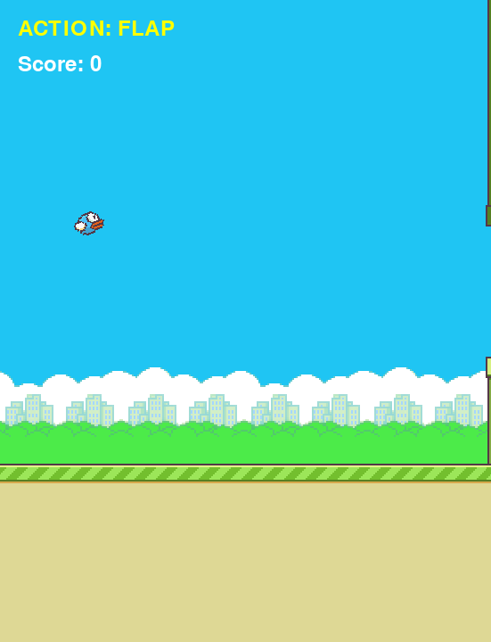

# 🐦 Flappy Bird AI: From RL to CNN

Projekt implementacji inteligentnego agenta grającego w klona Flappy Bird. Rozwój projektu zakłada przejście od klasycznego uczenia ze wzmocnieniem (Reinforcement Learning) po zaawansowane sieci splotowe (CNN).

## 🚀 O Projekcie
Celem projektu jest stworzenie AI, które nauczy się nawigować ptakiem pomiędzy rurami, optymalizując swój wynik na podstawie systemu nagród. Projekt bazuje na silniku **Pygame** i nowoczesnych standardach programowania w Pythonie.

## 📈 Etapy Rozwoju

### Faza 1: Klasyczne Reinforcement Learning (RL) - *W trakcie*
Agent podejmuje decyzje na podstawie wektora cech (state vector) wyciągniętego bezpośrednio z silnika gry:
* Pionowa prędkość ptaka.
* Dystans poziomy do najbliższej luki w rurach.
* Różnica wysokości między ptakiem a środkiem luki.

### Faza 2: Deep Q-Learning z CNN - *Planowane*
W tej fazie wejściem dla sieci neuronowej będzie surowy obraz klatek gry (pixels). 
* **Architektura:** Sieć splotowa (CNN) do ekstrakcji cech wizualnych.
* **Technologia:** PyTorch.

---

## 🛠 Technologia
* **Język:** Python 3.8+
* **Silnik gry:** Pygame


## 📁 Struktura Projektu
```text
├── assets/             # Grafiki (.png)
├── game.py             # Główny silnik gry
└── README.md           # Dokumentacja
```

## 📜 Podziękowania

Pierwsza wersja silnika gry oraz podstawowa logika obiektów zostały oparte na tutorialu:
* **Autor:** Clear Code
* **Materiał:** [Pygame Tutorial - Create a Flappy Bird Clone](https://www.youtube.com/watch?v=7IqrZb0Sotw)

