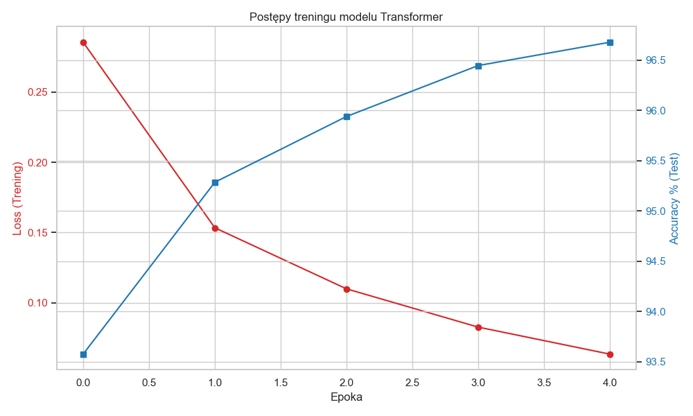
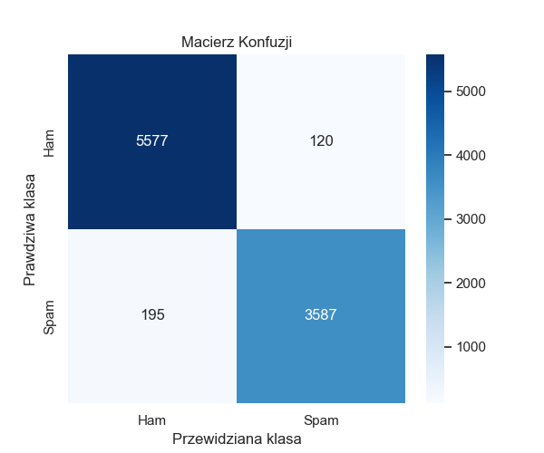

# 🛡️ Transformer Spam Classifier

Zaawansowany klasyfikator treści typu Spam/Ham wykorzystujący dedykowaną architekturę typu **Transformer** zbudowaną od podstaw w środowisku **PyTorch**. System rezygnuje z rekurencji (RNN) na rzecz równoległego przetwarzania kontekstu.

---

## 🧠 Głęboka Architektura i Działanie

Model implementuje architekturę typu "Encoder-only", optymalizowaną pod kątem ekstrakcji cech semantycznych z krótkich tekstów.


### 1. Mechanizm Self-Attention (Notacja Einsteina)
Sercem modelu jest autorska implementacja atencji, która pozwala każdemu słowu "patrzeć" na pozostałe słowa w zdaniu. Wykorzystujemy do tego transformacje:
* **Query ($Q$)**: Reprezentuje aktualne słowo szukające kontekstu.
* **Key ($K$)**: Reprezentuje etykietę informacyjną innych słów.
* **Value ($V$)**: Niesie rzeczywistą treść semantyczną.


Dzięki zastosowaniu `torch.einsum("nqhd,nkhd->nhqk", [q, k])`, model oblicza relacje między słowami z ogromną wydajnością obliczeniową, przypisując wyższe wagi tym parom słów, które wspólnie definiują naturę spamu (np. korelacja między słowem "free" a "prize").

### 2. Multi-Head Parallelism
Zaimplementowane 8 głowic atencji pozwala modelowi na jednoczesną analizę zdania na wielu poziomach:
* Relacje syntaktyczne (struktura zdania).
* Słowa kluczowe (identyfikacja wzorców spamu).
* Zależności dalekosiężne (kontekst na początku i końcu wiadomości).

### 3. Masked Global Average Pooling
W przeciwieństwie do standardowych modeli, które polegają na tokenie `[CLS]`, nasz model wykorzystuje **Masked Mean Pooling**. Funkcja ta oblicza średnią z reprezentacji wszystkich tokenów, ale dzięki dynamicznej masce binarnej całkowicie pomija wpływ paddingu (pustych miejsc) na wektor wynikowy. Gwarantuje to, że klasyfikator operuje wyłącznie na realnej treści wiadomości.


---

## 📈 Dashboard Analityczny i Ewaluacja

Po zakończeniu treningu skrypt generuje dashboard wizualny. Jest to kluczowy moment weryfikacji zdolności generalizacji modelu.

### Postępy Treningu (Loss vs Accuracy)
Wykres ten pozwala zdiagnozować, czy model się uczy (spadek Loss) i czy nie dochodzi do przeuczenia (overfitting).


### Macierz Konfuzji (Confusion Matrix)
Wizualizacja w palecie *Magma* pokazuje skuteczność wykrywania spamu:
* **True Positives:** Poprawnie wykryty spam.
* **False Positives:** Pomyłkowo zablokowane ważne wiadomości (najbardziej krytyczny błąd).


---

## ⚙️ Specyfikacja Techniczna

### Domyślne Hiperparametry
| Parametr | Wartość | Rola w modelu |
| :--- | :--- | :--- |
| **Embed Size** | 256 | Wymiarowość przestrzeni wektorowej słów |
| **Heads** | 8 | Liczba równoległych mechanizmów uwagi |
| **Layers** | 2 | Głębokość sieci (liczba bloków Transformera) |
| **Max Length**| 128 | Maksymalna długość analizowanej wiadomości |
| **Dropout** | 0.1 | Regularyzacja zapobiegająca przeuczeniu |

---

## 🚀 Uruchomienie

Aby zainicjować proces uczenia i generowania raportów:

```bash
python main.py
